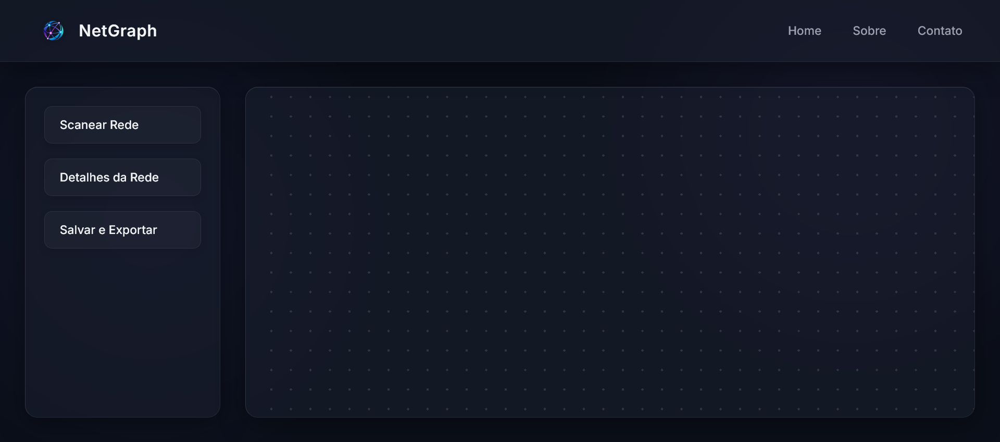
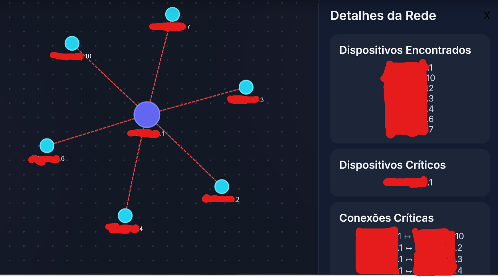

# NetGraph
Desenvolvimento de um Mapeador de Redes de Computadores utilizando grafos e Nmap: Para Apresentação Visual de uma Rede de Computadores LAN, utilizando conceitos de Teoria dos Grafos como Vértices e Arestas de Corte e Centralidade para disponibilizar dados analíticos para Administradores e Analistas de Rede.

---

## Identificação do Grupo

| Campo | Preenchimento |
|-------|---------------|
| Nome do projeto | NetGraph |
| Repositório GitHub | https://github.com/williamsouzadasilva444/NetGraph |
| Link Apresentação Projeto | https://www.youtube.com/watch?v=S74AXhPRS80 |
| Integrante 1 | William Souza — 41057619 |
| Integrante 2 | Matheus Akira Saito de Souza — 38746344 |
| Integrante 3 | José Gonçalves Braz Júnior — 40789659 |

---

## 1. Como Executar o MVP

> O projeto esta instavel e nao robusto o suficiente para funcionar em qualquer computador, por favor, não utilize o NetGraph em redes compartilhadas. Se você possui algum VPN, considere desativar a interface dele para testes mais precisos.

**Pré-requisitos:**

```bash
Python 3.14+, nmap 7.99+ e npcap (Normalmente instalado junto com a instalacao do nmap)
```

**Instalação:**

```bash
git clone https://github.com/williamsouzadasilva444/NetGraph
cd NetGraph
pip install -r requirements.txt
```

**Execução:**

```bash
python app.py
```

**Saída esperada:**

```
Censurando IPs por segurança, projeto deve exibir o IPv4 local dos dispositivos conectados da sua rede:

 * Serving Flask app 'app'
 * Debug mode: on
WARNING: This is a development server. Do not use it in a production deployment. Use a production WSGI server instead.
 * Running on http://127.0.0.1:5000
Press CTRL+C to quit
 * Restarting with stat
Varrendo a rede XXX.XXX.XXX.0/24... (Isso pode demorar alguns segundos)
 * Debugger is active!
 * Debugger PIN: 110-651-048
```

---

## 2. Algoritmo Implementado

| Campo | Resposta |
|-------|----------|
| Nome do algoritmo | Tarjan |
| Arquivo de implementação | src/algorithms/tarjan.py |
| Complexidade de tempo | O(V + E) |
| Complexidade de espaço | O(V + E) |

**Trecho do código com comentário de Big-O:**

```python
def dfs_tarjan(
    vertice_in, grafo, visitado, desc_temp, low, pais, pontes, articulacao, tempo
):
    visitado.append(vertice_in)

    desc_temp[vertice_in] = tempo[0]

    low[vertice_in] = tempo[0]

    tempo[0] += 1


    filhos = 0

    for vertice in grafo[vertice_in]:
        if vertice not in visitado:

            pais[vertice] = vertice_in

            filhos += 1

            dfs_tarjan(
                vertice,
                grafo,
                visitado,
                desc_temp,
                low,
                pais,
                pontes,
                articulacao,
                tempo,
            )

            low[vertice_in] = min(low[vertice_in], low[vertice])

            if desc_temp[vertice_in] < low[vertice]:
                pontes.append((vertice_in, vertice))

            if pais[vertice_in] is not None and desc_temp[vertice_in] <= low[vertice]:
                articulacao.append(vertice_in)

        elif vertice != pais[vertice_in]:s
            low[vertice_in] = min(low[vertice_in], desc_temp[vertice])

    if pais[vertice_in] is None and filhos > 2: 
        articulacao.append(vertice_in)

    return

# com comentários de complexidade nas linhas críticas
```

---

## 3. Estrutura do Repositório

> Confirme que a estrutura implementada está de acordo com o E2.

```
NetGraph/
├── src/
│   ├── core/
|   ├── ├── conexoes.py
|   |   ├── lista_adjacente.py
|   |   ├── grafo.py
|   |   └── nx_grafo.py
│   ├── algorithms/
|   |   ├── tarjan.py
|   |   └── centralidade.py
│   ├── io/
|   |   └── scanner.py
|   ├── ui/
|   |   ├── image/
|   |   ├── static/
|   |   |   └── grafo.html
|   |   ├── index.html
|   |   ├── script.js
|   |   ├── style.css
|   |   └── sobre.html
|   ├── assets/
├── tests/
│   └── test_tarjan.py
├── data/
│   └── grafo_exemplo.json
│   └── grafo_completo_exemplo.json
├── docs/
|   ├── E1_Grupo3_Avaliação.md
|   ├── E2_Grupo3_Designer_Tecnico.md
│   └── E3_Grupo3_MVP.md
├── Documentacao_Mudancas.html
├── .gitignore
├── README.md
└── requirements.txt
```

**Desvios em relação ao E2** *(se houver)*: 
- README.md movido de docs para pasta raiz, para visualizacao no repositorio
- lista_adjacente.py contem uma funcao que seria o devices.py da estrutura anterior
- graph_dashboard.py retirado
- json_exporter.py trocado por scanner.py

---

## 4. Telas do MVP

### Tela de Entrada



*Descrição: Interface do Netgraph, onde será feito o scan e o algoritmo de tarjan será aplicado, detalhes do grafo irá apresentar o IPS scaneados, pontes, vértice de corte e vértice mais central*

### Tela de Resultado



*Descrição: Tela de resultado netgraph*

---

## 5. Testes Unitários

| Algoritmo | Caso de teste | Status | Comando para executar |
|-----------|--------------|--------|----------------------|
| Tarjan | Caso base | ✅ | `python -m pytest tests/ -v` |
| Tarjan | Grafo vazio | ✅ | `python -m pytest tests/ -v` |
| Tarjan | Grafo completo | ✅ | `python -m pytest tests/ -v` |

**Como rodar todos os testes:**

```bash
`python -m pytest tests/ -v`
```

**Resultado atual:**

```
collected 3 items

tests/test_tarjan.py::test_base_tarjan PASSED [33%]
tests/test_tarjan.py::test_grafo_nulo PASSED [66%]
tests/test_tarjan.py::test_grafo_completo PASSED [100%]
```

---

## 6. Histórico de Commits

> Liste os 5+ commits mais relevantes desta entrega.

| Hash (7 chars) | Mensagem | Autor |
|----------------|----------|-------|
| `b84a5c7` | feat: feat: adicionando interface web | William |
| `460a740` | feat: implementando scanner | Matheus(Mazzo)|
| `ba9e9cc` | feat: implementando construcao do grafo por meio de uma lista de adjacencia | Matheus(Mazzo) |
| `853599d` | feat: implementando algoritmo principal: Tarjan | Matheus(Mazzo) |
| `26559ee` | test: adicionando testes unitarios | Matheus(Mazzo) |
| `66ff9c4` | feat: atualizando o design e o flask netgraph | William |
| `bdc21f6` | feat: implementando calculo de centralidade via networkx | Matheus (Mazzo) |
| `b013411` | fix: atualizando visualização via web | William e Matheus (Mazzo) |
| `09d800c` | feat: adicionando detalhes do grafo + ajustes finais | Matheus (Mazzo) |

---

## 7. O que está funcionando / O que ainda falta

| Funcionalidade | Status | Observação |
|---------------|--------|------------|
| Mapear estrutura de rede via nmap | ✅ Completo | Capturamos todas as informações necessários de forma que consiga indentificar o subnet e rede do usuário automaticamente |
| Algoritmo principal | ✅ Completo | Sem observação |
| Tela de entrada | ✅ Completo | Frontend funcionando |
| Tela de resultado | ✅ Completo | Resultados corretos de acordo com a rede do usuário, pode variar |
| Testes unitários | ✅ Completo | Sem observacao |
| Calcular centralidade | ✅ Completo | Centralidade aplicada utilizando NetworkX |
| Leitura de arquivo | ❌ Incompleto | Nenhuma leitura de arquivo foi implementada, a não ser via scan automático  |

---

## Checklist de Entrega

- [ X ] Repositório público e acessível
- [ X ] .gitignore configurado
- [ X ] README com instruções de execução do MVP
- [ X ] Algoritmo principal executando sem erros
- [ X ] Tela de entrada e tela de resultado demonstráveis
- [ X ] 3 testes unitários por algoritmo (mínimo caso base passando)
- [ X ] ≥ 5 commits com prefixos semânticos (feat:, fix:, test:, docs:)
- [ X ] Ao menos 1 arquivo de grafo de exemplo em `data/`

---

*Teoria dos Grafos — Profa. Dra. Andréa Ono Sakai*